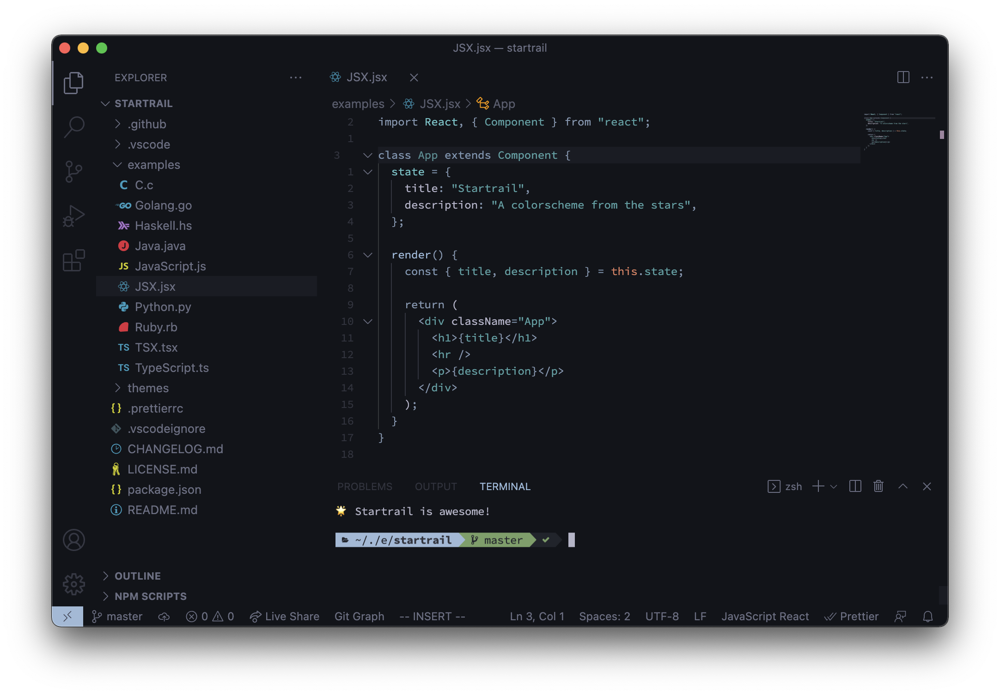

<p align="center">
  
</p>

# VSCode Startrail

   

A colorscheme from the stars, now available for Microsoft's [Visual Studio Code](https://code.visualstudio.com/), brought to you as a port of the [original Startrail colorscheme](https://github.com.gantoreno/vim-startrail) from the Vim editor.

<p align="center">
  
</p>

## Install

Installation is as simple as going to your terminal and typing:

```sh
ext install startrail
```

Then, go to `Preferences > Color Theme > Startrail`, and select it from the dropdown list, and voilà! Startrail is ready to go.

## License

Licensed under the [GNU GPLv3](https://www.gnu.org/licenses/gpl-3.0.html) license.
